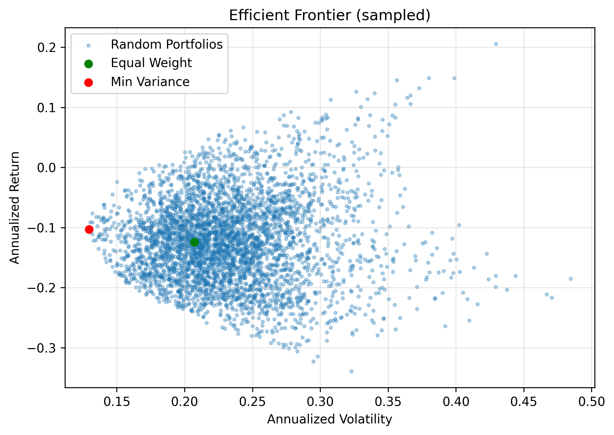
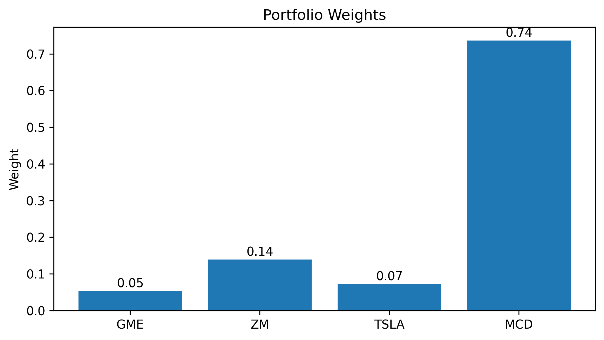

## Applied Linear Algebra Honors Project

This repository, **Applied Linear Algebra Honors Project**, contains my honors contract work for Applied Linear Algebra, focusing on practical applications of linear algebra using Python.

The code in `scripts/` generates the quantitative analyses and figures stored in `figures/`, using data from `data/`. Notes and short writeups are in `notes/` and `reports/`.

### Project Overview

- Explore real-world applications of linear algebra in finance and data analysis.
- Use vectors, matrices, eigen-decomposition, and least squares methods in concrete case studies.
- Produce reproducible Python code and publication-quality figures.

### Key Visuals



The efficient frontier plot shows the trade-off between **expected return** and **volatility (risk)** for a family of portfolios constructed from the underlying assets. Each point corresponds to a different portfolio (i.e., different weights that sum to 1), and the frontier highlights the **mean–variance optimal** choices. You can interpret it by:

- Looking **horizontally**: for a given level of risk (standard deviation on the x-axis), the frontier gives you the **maximum achievable expected return**.
- Looking **vertically**: for a target expected return (y-axis), the frontier identifies the **minimum-risk** portfolio that attains it.
- Comparing portfolios on and below the frontier to understand how far a given allocation is from the theoretical optimum under the model assumptions.



The portfolio weights plot shows the **optimized allocation** across each asset in the universe. Bars above zero represent **long positions**, and (if present) bars below zero represent **short positions**. You can use it to:

- See which assets carry the **largest weight** and therefore contribute most to the portfolio’s risk and return.
- Compare different optimization runs (e.g., different risk aversion levels or constraints) by how they **reallocate weight** among assets.
- Connect the weight pattern back to the efficient frontier: more aggressive (high-return) portfolios typically concentrate weight in higher-volatility assets, while more conservative portfolios spread weight more evenly or favor lower-volatility names.

### Repository Structure

- `scripts/` – Python scripts for data processing, analysis, and figure generation.
- `data/` – Input datasets (CSV/JSON) used by the scripts.
- `figures/` – Generated plots and visualizations.
- `notes/` – Weekly summaries and technical notes.
- `reports/` – Short reports and project writeups.

### Technical Stack

- Python (data analysis and visualization)
- Common scientific libraries (e.g., NumPy, pandas, Matplotlib/Seaborn)

If you would like a minimal environment, you can typically install these with:

```bash
pip install numpy pandas matplotlib seaborn
```

### How to Run

1. Clone the repository (replace the URL if your GitHub slug is different):

```bash
git clone https://github.com/thomasyunghint/Applied-Linear-Algebra-Honors-Project.git
cd Applied-Linear-Algebra-Honors-Project
```

2. (Optional but recommended) Create a virtual environment:

```bash
python -m venv .venv
.\.venv\Scripts\activate
```

3. Install dependencies (either from `requirements.txt` if you add one, or manually as above).

4. Run the analysis scripts in `scripts/` as indicated by their filenames or comments.

### Acknowledgements

I would like to thank **Professor Tolosa** for guidance and feedback throughout this honors contract project.

